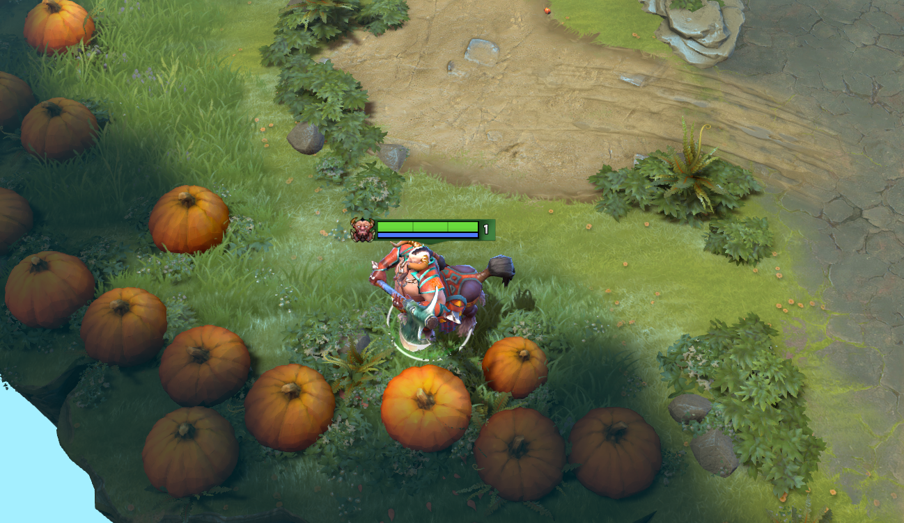

### How To:
* Download [latest release](https://github.com/genchsusu/Dota2Patcher/releases/latest);
* Download [auto_accept.zip](https://github.com/genchsusu/Dota2Patcher/blob/master/auto_accept.zip);

## [gameinfo.gi CRC file check](https://www.reddit.com/r/DotA2/comments/s46mj8/dota_2_update_for_11422_11522_utc) bypass
Allows you to use vpk mods
Patch client.dll and gameinfo.gi

### How To:
* Drop desired vpk to your mods folder inside `\dota 2 beta\game\` (ex: `\dota 2 beta\game\dota_tempcontent`);

You can use `config.json` if the regestry doesn't work.

```
{
    "dota2_path": "D:\\Steam\\steamapps\\common\\dota 2 beta\\game\\"
}
```


